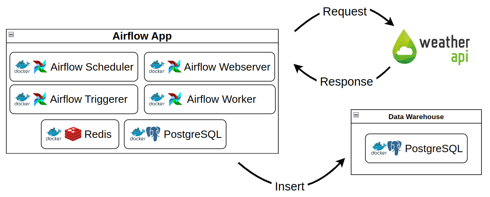
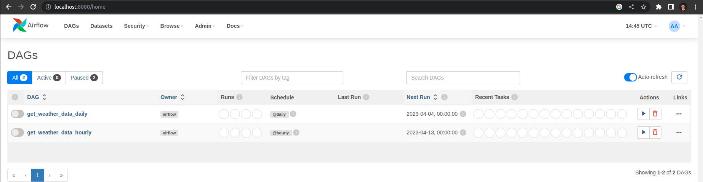

# Sample Data Ingestion Pipeline
Containerized data ingestion pipeline that collects weather data every hour from WeatherAPI and loads it to a Postgres data warehouse.
The chosen pipeline orchestration tool was Airflow, and all the infrastructure is configured and provisioned by making use of Docker Products.



## 💻 Pre-requisites

Before starting, please make sure you meet the following requirements:
* MacOS or Linux based OS. (I am running the project on Ubuntu 22.04.2 LTS. I haven't tested it on WSL, though it should probably work with some adaptation or another, due to the fact that Docker runs slightly different on WSL)
* Docker and Docker Compose are installed. (My installed versions are: Docker version 23.0.3; Docker Compose version v2.15.1)
* WeatherAPI account created (the free plan is enough for our purposes) and API key in hands. WeatherAPI's website: https://www.weatherapi.com

## ⚙ Configuration instructions

Please follow the following steps to get your pipeline up and running:

1. Clone this repository on your machine:
```
git clone https://github.com/FelipeNoogueira/sample-data-ingestion-pipeline.git
```

2. Run this command and paste the output on a new line on the **.env** file:
```
echo -e "AIRFLOW_UID=$(id -u)"
```

3. Paste your WeatherAPI account's API key inside the empty double quotes in the **config/variables.json** file. It should look like this:
```
{
    "secret_weatherapi_key": "<YOUR API KEY>"
}
```

## 🚀 Starting the pipeline
In order to start the pipeline, some steps are required:
1. The source Docker images must be pulled from Docker Hub.
2. The project's extended images must be built.
3. Some Airflow Variables and Connections must be imported from JSON config files located in this repository as soon as Airflow's containers are up and running.

That's precisely what is performed by the **init.sh** script. Therefore, in order to start the pipeline's containers, go to this project's root directory in your terminal and execute the following command:

```
bash init.sh
```

If the final output is 'Configs were imported!', everything should have worked as exepected. You can check if your containers are running by running the command:

```
docker ps
```

As soon as you've verified that your containers are running and healthy, there's only one last thing to do. Access Airflow's Web UI on your Web Browser by typing: **localhost:8080**. You should see this screen:


